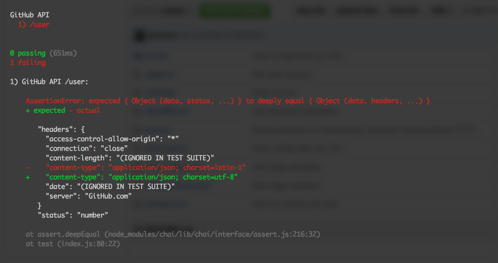

# pointing-fingers

Simple tool for tracking changes to an upstream API as part of your test suite

## Wait but why?

TODO

## Installation

TODO

## Examples

This is an example that uses all available options:

```js
/* eslint-env mocha */

import { assert } from 'chai'; // @see http://chaijs.com/api/assert/
import { testUpstreamChanges } from 'pointing-fingers'; // @see https://github.com/jareware/pointing-fingers

describe('GitHub API', () => {

    testUpstreamChanges({
        learn: false,
        fixtures: 'test/fixtures/',
        runner: it,
        assert: assert.deepEqual,
        placeholder: '(IGNORED IN TEST SUITE)',
        ignores: [
            'data.documentation_url',
            'headers.content-length',
            'headers.date'
        ],
        transforms: [
            res => res.status = (res.status >= 400 && res.status < 500)
        ],
        headers: {
            'X-Api-Key': process.env.MY_SECRET_KEY
        },
        method: 'GET',
        base: 'https://api.github.com',
        urls: [
            '/user'
        ]
    });
  
});
```

Running this test will request `GET https://api.github.com/user`, which yields the following raw response object (some headers are omitted for brevity):

```json
{
    "data": {
        "documentation_url": "https://developer.github.com/v3",
        "message": "Requires authentication"
    },
    "headers": {
        "access-control-allow-origin": "*",
        "connection": "close",
        "content-length": "91",
        "content-type": "application/json; charset=utf-8",
        "date": "Sun, 21 Feb 2016 10:50:27 GMT",
        "server": "GitHub.com"
    },
    "status": 401,
    "statusText": "Unauthorized"
}
```

And by setting `learn: true`, the following file will be written to `./test/fixtures/user.json`:

```json
{
    "data": {
        "documentation_url": "(IGNORED IN TEST SUITE)",
        "message": "Requires authentication"
    },
    "headers": {
        "access-control-allow-origin": "*",
        "connection": "close",
        "content-length": "(IGNORED IN TEST SUITE)",
        "content-type": "application/json; charset=utf-8",
        "date": "(IGNORED IN TEST SUITE)",
        "server": "GitHub.com"
    },
    "status": true,
    "statusText": "Unauthorized"
}
```

Then, you can set `learn: false`, commit your test file and JSON fixtures to version control, and run your test suite:


If at some point in the future GitHub suddenly changes their charset, you'll see:



This should give you an idea of what parts of your application you should check for compatibility with the upstream API changes. Once you're done, set `learn: true`, re-run the test suite, set `learn: false`, commit changed fixtures to version control, and you're back to:


